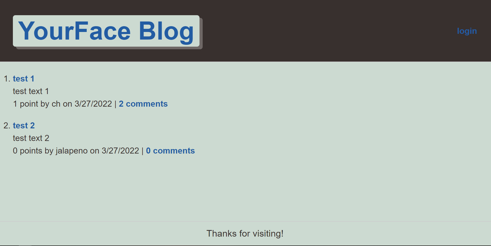

[](https://opensource.org/licenses/MIT)

# YOURFACE-BLOG

## Description

The purpose of this project was to develop and showcase knowledge using Handlebars npm package by creating a blog styled site.

## Demo



[View Live Site Here](https://shrouded-fortress-91419.herokuapp.com/)

## Built With

  

## Table of Contents

- [Installation](#Installation)
- [Usage](#Usage)
- [License](#License)

## Installation

Users who would like to use this offline, on local machines, should run the following commands

```
1. npm install
2. npm run schema
```

## License

[](https://opensource.org/licenses/MIT)

### &copy; 2022 Charlton-H

```

```
